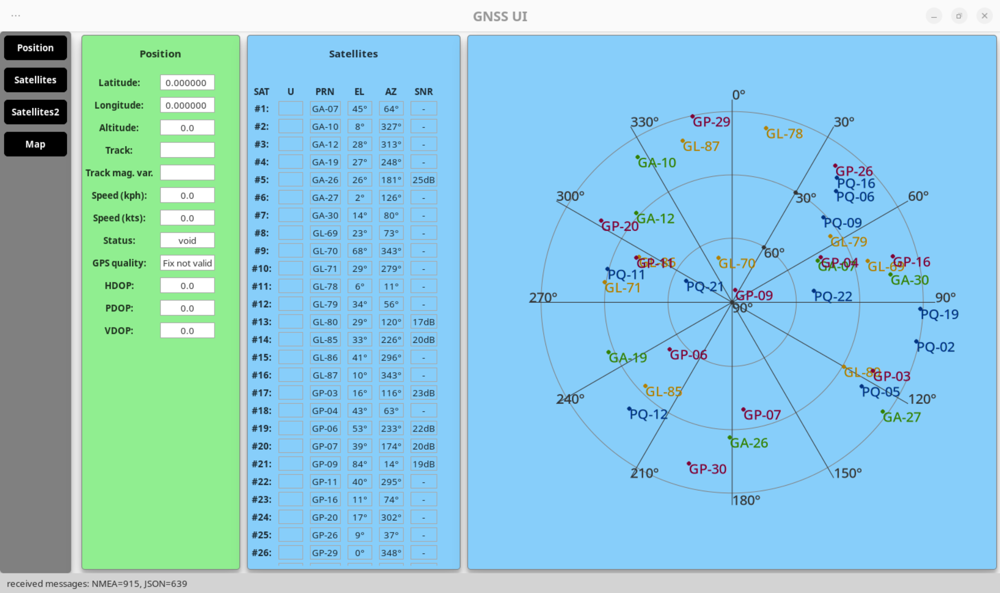
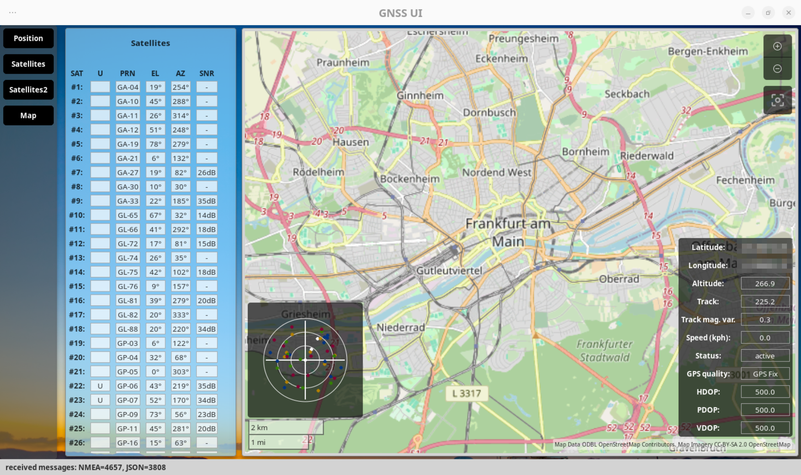
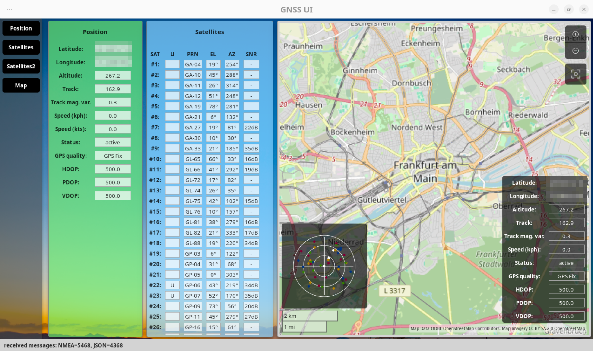
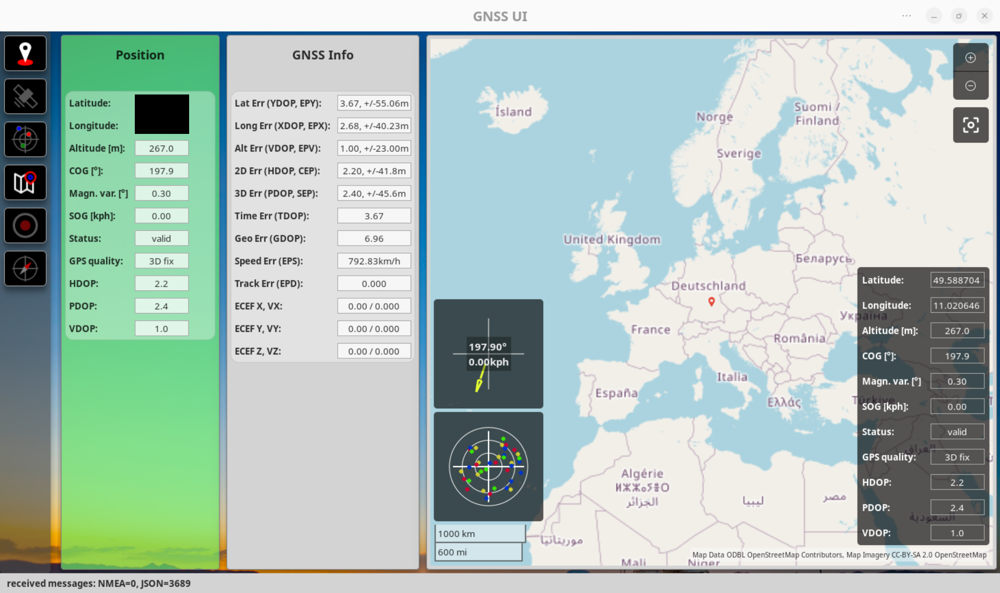

# gnss-ui
GTK4 / Python based GNSS dashboard to display information gathered from GNSS receivers. The application includes a simple GPSD client that is capable of requesting NMEA and JSON data from a GPSD instance.

NOTE: This application is work in progress and possibly unstable, so things may break!

The UI allows displaying various information, such as:

* current position and gps quality
* current satellites in view and available
* positions of the satellites in a graphical view
* a map with the current position

In addition, the application allows recording GNSS tracks and exporting to GPX files.

Some screenshots:

## Prerequisites
A GPSD instance must run in the background to get real data.

## Further information
The application has been tested on a notebook with an integrated Quectel EM-05G modem. Compatibility with other Models not guaranteed.
