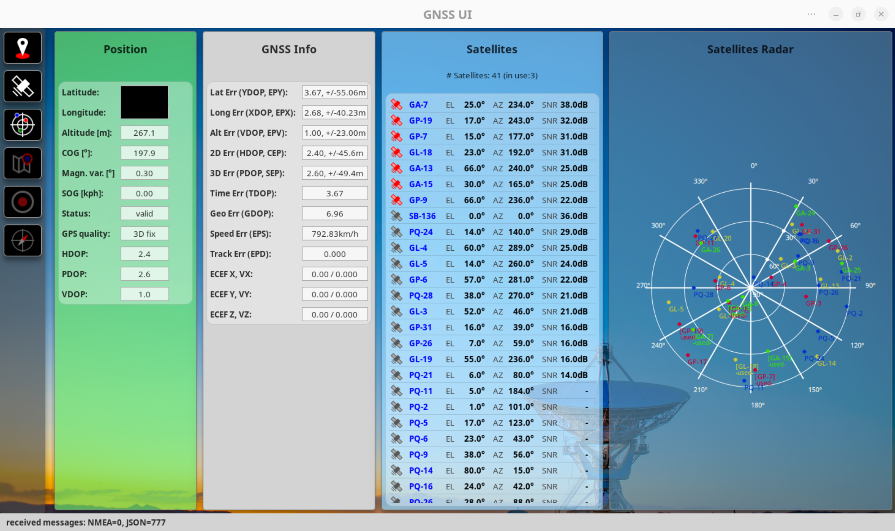
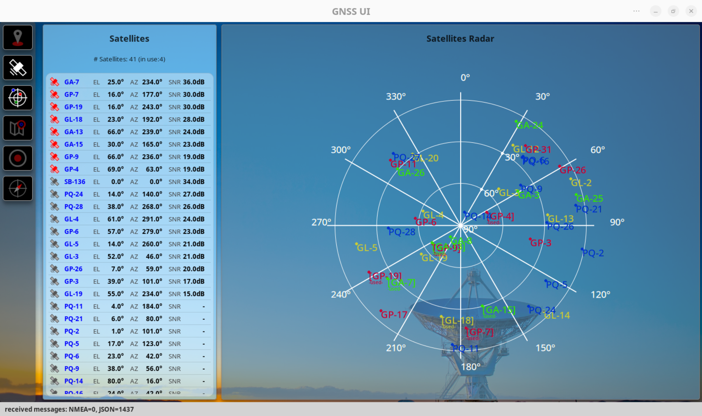
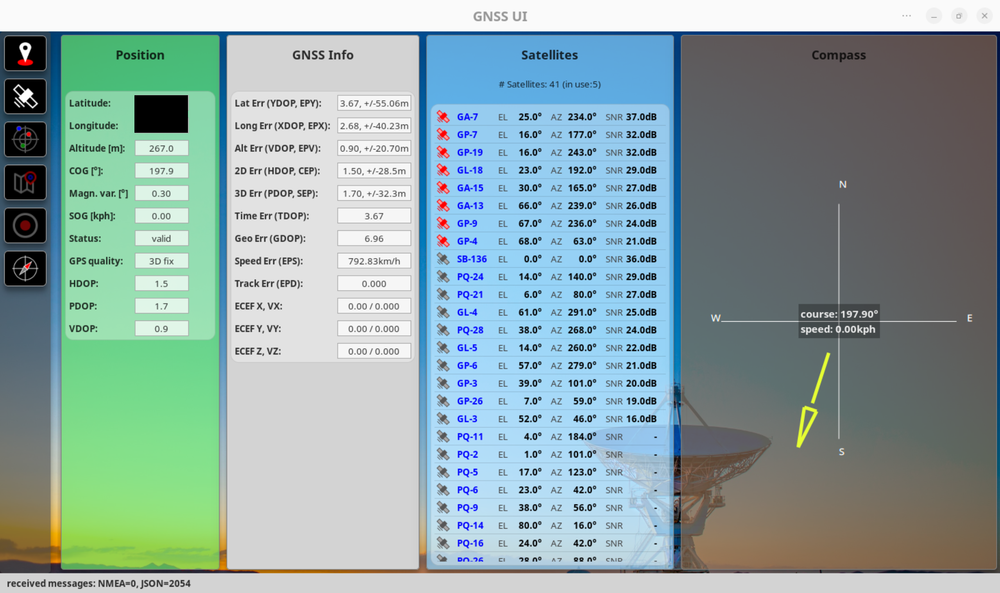

# gnss-ui
GTK4 / Python based GNSS dashboard to display information gathered from GNSS receivers. The application includes a simple GPSD client that is capable of requesting NMEA and JSON data from a GPSD instance.

NOTE: This application is work in progress and possibly unstable, so things may break!

The UI allows displaying various information, such as:

* current position and gps quality
* current satellites in view and available
* positions of the satellites in a graphical view
* a map with the current position

In addition, the application allows recording GNSS tracks and exporting to GPX files.

Some screenshots:

## Installation

Several methods are possible to use or install the gnss-ui:

1. git: just clone the repo and start `gnss-ui.py` in the `src` subdirectory.
2. arch linux: a separate project to build an arch linux package exists at https://github.com/mr-ingenious/gnss-ui-pkg. Please find further explanations there.
3. If time permits, maybe packaging for other linux distributions will be added.

## Configuration
The application is configurable via the `appconfig.json` file located at `~/.config/gnss-ui`. The file is created automatically at first startup. Changes are effective after application restart.

Example (default settings):

    {
        "created": "2024-07-11 22:14:18",
        "last_update": "2024-07-11 22:14:18",
        "config": {
            "general": {
                "panel_refresh_cycle_sec": 2,
                "resolution": {
                    "height": 800,
                    "width": 1200
                }
            },
            "ttyc": {
                "ttyname": "/dev/ttyUSB1",
                "baudrate": 9600
            },
            "gpsd": {
                "hostname": "localhost",
                "port": 2947
            },
            "startup": {
                "connect_to_gpsd": true,
                "panels_shown": [
                    "map",
                    "satellites_list"
                ]
            },
            "map_panel": {
                "auto_center": true,
                "initial_zoom_level": 5,
                "show_satellites_dashboard": true,
                "show_position_dashboard": true,
                "show_compass_dashboard": true,
                "start_latitude": 0.0,
                "start_longitude": 0.0
            },
            "recording": {
                "export": {
                    "directory": "~/.gnss-ui"
                }
            }
        }
    }

Description of the configuration options:

| Configuration group | Description |
|---|---|
| general | Configuration of the default resolution of the UI and the refresh cycle of the panels | 
| ttyc  | Serial connection settings, if modem or GNSS receiver output (NMEA0183 format) shall be used directly |
| gpsd | Connection settings for use of gpsd. The gpsd JSON output format will be used |
| startup | Settings for startup, e.g., whether a connection to gpsd or serial connection shall be automatically established, or which panels are visible (possible values: "position", "satellites_list", "satellites_radar", "map", "compass", "recorder") |
| map_panel | Various settings for the map panel, such as start position of the map (default: 0,0), the zoom level or visibility of different dashboards within the map panel |
| recording | Recording specific settings, such as the export directory |

## Usage

To make use of gpsd (see https://gpsd.gitlab.io/gpsd/ ) the daemon must be running in the background, but can also be started manually, e.g. for testing: `gpsd -nND5 /dev/ttyUSB1`. Refer to `gpsd` settings in the `appconfig.json`.

Another possibility is to use the GNSS output from the modem / GNSS receiver directly (e.g., `/dev/ttyUSB1`) - see `ttyc` settings in the `appconfig.json`.

## Further information

The application has been tested on a notebook with an integrated Quectel EM-05G modem, connected to gpsd and also via a direct connection to the serial GNSS output of the modem.

Compatibility with other modems or GNSS receivers is not guaranteed.
